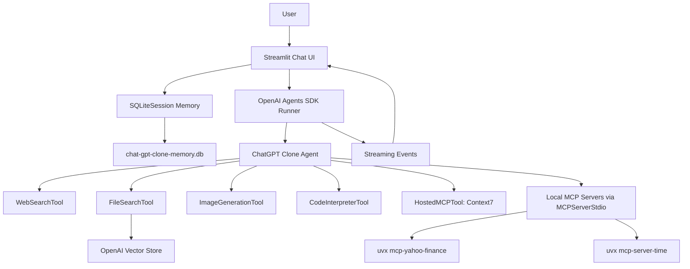
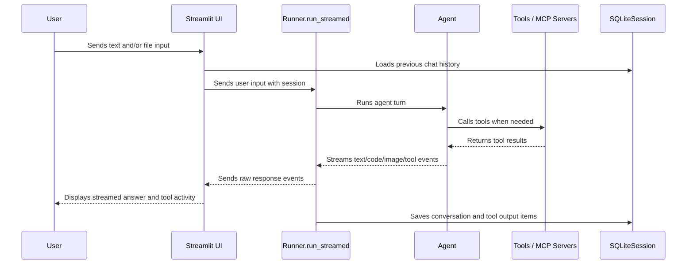
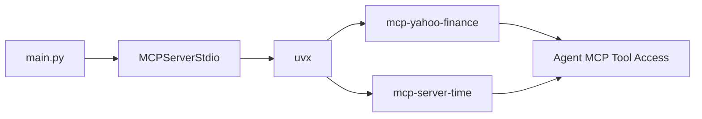
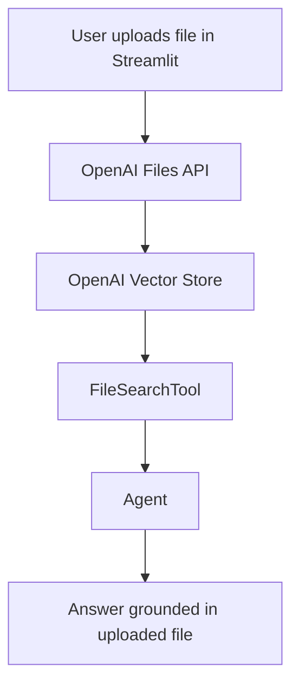

# ChatGPT Clone with OpenAI Agents SDK, Streamlit, and MCP Tools

A full-stack ChatGPT-style assistant built with **Streamlit** and the **OpenAI Agents SDK**. This project recreates the core user experience of ChatGPT while adding agentic tool use, persistent memory, file search, image generation, code execution, hosted MCP tools, and local MCP servers launched through `uvx`.

The project is designed as a practical AI engineering portfolio project. It demonstrates how to build a modern AI assistant UI, connect it to OpenAI-hosted tools, run local Model Context Protocol servers, stream model responses in real time, persist chat history, and expose tool activity back to the user in a transparent way.

---

## Project Summary

This application gives users a browser-based chat interface where they can:

- Chat with an AI assistant in a ChatGPT-style UI.
- Upload text-like files such as `.txt`, `.md`, `.csv`, and `.json` for file search.
- Upload image files such as `.jpg`, `.jpeg`, and `.png` for multimodal input.
- Use OpenAI-hosted tools such as web search, file search, image generation, and code interpreter.
- Use a hosted MCP server, Context7, for software documentation lookup.
- Use local MCP servers started with `uvx`, including:
  - `mcp-yahoo-finance` for Yahoo Finance-style market data tools.
  - `mcp-server-time` for timezone and local time tools.
- Persist conversation history with `SQLiteSession`.
- View tool activity, including MCP tool listings and MCP tool-call outputs, inside the Streamlit chat history.

---

## Why This Project Matters

Most simple chatbot projects only send a prompt to a model and display a response. This project goes further by showing a more realistic architecture for production-style AI assistants:

1. **Agent orchestration** using the OpenAI Agents SDK.
2. **Tool-augmented reasoning** through web search, file search, code interpreter, image generation, and MCP tools.
3. **Persistent memory** through SQLite-backed sessions.
4. **Streaming UX** so users see responses, code, and partial images as they are generated.
5. **Transparent tool visibility** so users can see when tools were listed, called, and what outputs were returned.
6. **Local MCP server integration** using `uvx`, which shows how the assistant can connect to custom tool servers outside the OpenAI platform.

For recruiters, this project demonstrates practical skills in Python, Streamlit, agentic AI, OpenAI APIs, tool calling, MCP, async programming, session management, and user-facing product design.

---

## Tech Stack

| Layer | Technology | Purpose |
|---|---|---|
| UI | Streamlit | ChatGPT-style browser interface |
| Agent Framework | OpenAI Agents SDK | Agent creation, tool orchestration, streaming, sessions |
| Model/API Client | OpenAI Python SDK | File uploads and vector store integration |
| Memory | SQLiteSession | Persistent chat history stored locally |
| File Search | OpenAI FileSearchTool + Vector Store | Search uploaded files |
| Web Search | OpenAI WebSearchTool | Retrieve current web information |
| Code Execution | OpenAI CodeInterpreterTool | Run code for analysis/calculation tasks |
| Image Generation | OpenAI ImageGenerationTool | Generate images from prompts |
| Hosted MCP | HostedMCPTool | Connect to hosted MCP servers such as Context7 |
| Local MCP | MCPServerStdio + `uvx` | Run local MCP servers from the terminal/runtime |
| Environment Variables | python-dotenv | Load `.env` values such as `OPENAI_API_KEY` |

---

## High-Level Architecture



---

## Data Flow



---

## Local MCP Server Flow with `uvx`

This project uses local MCP servers with `MCPServerStdio`. Instead of manually installing and running a separate server process, the app starts MCP servers using `uvx`.



In the code, the Yahoo Finance MCP server is started like this:

```python
 yfinance_server = MCPServerStdio(
     params={
         "command": "uvx",
         "args": ["mcp-yahoo-finance"],
     },
     cache_tools_list=True,
 )
```

The timezone MCP server is started like this:

```python
 timezone_server = MCPServerStdio(
     params={
         "command": "uvx",
         "args": ["mcp-server-time", "--local-timezone=America/New_York"],
     },
     cache_tools_list=True,
 )
```

These servers are then attached to the agent through the `mcp_servers` argument:

```python
agent = Agent(
    name="ChatGPT Clone",
    mcp_servers=[yfinance_server, timezone_server],
    tools=[...],
)
```

This means the assistant can automatically discover and use tools exposed by those local MCP servers when they are relevant to the user's request.

---

## Repository Structure

Based on the current project files, the core structure is:

```text
chatgpt-clone-agents-sdk/
├── main.py                  # Main Streamlit app
├── .env                     # Local environment variables, not committed
├── .gitignore               # Should exclude .env, virtual environments, databases, caches
├── pyproject.toml           # Python project dependencies if using uv
├── uv.lock                  # Locked dependency versions if using uv
└── README.md                # Project documentation
```

The current implementation is concentrated in `main.py`, which contains:

- Streamlit page setup.
- Session initialization.
- Chat history rendering.
- MCP tool display helpers.
- MCP call output rendering.
- Agent construction.
- Local MCP server startup.
- Streaming event handling.
- File upload handling.
- Vector store file ingestion.
- Main chat input loop.

---

## Main Features

### 1. Streamlit ChatGPT-Style UI

The app uses Streamlit as the frontend UI layer.

Important UI elements include:

```python
st.set_page_config(
    page_title="ChatGPT Clone",
    page_icon="🤖",
    layout="wide",
)

st.title("🤖 ChatGPT Clone")
st.caption("Built with OpenAI Agents SDK, hosted tools, MCP tools, file search, image generation, and code interpreter.")
```

The chat input is created with:

```python
prompt = st.chat_input(
    "Write a message for your assistant...",
    accept_file=True,
    file_type=["txt", "md", "csv", "json", "jpg", "jpeg", "png"],
)
```

This gives the app a ChatGPT-like interface while also supporting file uploads directly inside the chat input.

---

### 2. Persistent Memory with SQLiteSession

The project uses `SQLiteSession` from the OpenAI Agents SDK:

```python
SESSION_DB = "chat-gpt-clone-memory.db"
SESSION_ID = "chat-history"

if "session" not in st.session_state:
    st.session_state["session"] = SQLiteSession(SESSION_ID, SESSION_DB)
```

This stores the conversation history in a local SQLite database file named:

```text
chat-gpt-clone-memory.db
```

Because the `session` is passed into `Runner.run_streamed`, the agent can preserve previous messages across turns:

```python
stream = Runner.run_streamed(
    agent,
    user_input,
    session=session,
)
```

The sidebar includes a memory reset button:

```python
if st.button("Reset memory", type="secondary"):
    asyncio.run(session.clear_session())
    st.success("Memory reset. Refreshing...")
    st.rerun()
```

This lets users clear local chat history when they want a fresh conversation.

---

### 3. OpenAI Agents SDK Agent

The core assistant is created with the `Agent` class:

```python
def build_agent(yfinance_server: MCPServerStdio, timezone_server: MCPServerStdio) -> Agent:
    return Agent(
        name="ChatGPT Clone",
        instructions="""
You are a helpful assistant inside a ChatGPT-style Streamlit app.

Behavior:
- Answer clearly and naturally.
- Use web search for current or niche information.
- Use file search when the user asks about uploaded documents.
- Use code interpreter for calculations, data analysis, files, and charts.
- Use image generation only when the user asks to create or edit images.
- Use MCP tools when they are relevant.
- When you use external information, explain where it came from when possible.
""",
        mcp_servers=[yfinance_server, timezone_server],
        tools=[...],
    )
```

The `instructions` define the assistant's behavior and clarify when it should use each tool.

---

### 4. Hosted Tools

The project attaches several OpenAI-hosted tools to the agent.

#### Web Search

```python
WebSearchTool()
```

Used when the assistant needs current or external information.

#### File Search

```python
FileSearchTool(
    vector_store_ids=[VECTOR_STORE_ID],
    max_num_results=3,
)
```

Used to search files uploaded into the configured vector store.

#### Image Generation

```python
ImageGenerationTool(
    tool_config={
        "type": "image_generation",
        "quality": "high",
        "output_format": "jpeg",
        "moderation": "low",
        "partial_images": 1,
    }
)
```

Used when the user asks the assistant to generate an image.

#### Code Interpreter

```python
CodeInterpreterTool(
    tool_config={
        "type": "code_interpreter",
        "container": {"type": "auto"},
    }
)
```

Used when the assistant needs to run Python code, analyze data, compute results, or work with files.

---

### 5. Hosted MCP Tool: Context7

The project also uses `HostedMCPTool` to connect to Context7:

```python
HostedMCPTool(
    tool_config={
        "type": "mcp",
        "server_label": "Context7",
        "server_description": "Use this to get current documentation from software projects.",
        "server_url": "https://mcp.context7.com/mcp",
        "require_approval": "never",
    }
)
```

Context7 is useful when the assistant needs current software documentation. For example, a user can ask questions about a Python library, framework, or SDK, and the assistant can retrieve relevant documentation through the hosted MCP server.

---

### 6. Local MCP Servers with `uvx`

The project demonstrates local MCP integration with two servers:

1. Yahoo Finance MCP server.
2. Timezone MCP server.

They are launched using `uvx`, which allows Python tools/packages to be executed without manually creating a separate project environment for each server.

The servers are started inside `run_agent`:

```python
async def run_agent(user_input: str | list[dict[str, Any]]) -> None:
    yfinance_server = MCPServerStdio(...)
    timezone_server = MCPServerStdio(...)

    async with yfinance_server, timezone_server:
        agent = build_agent(yfinance_server, timezone_server)
        ...
```

The `async with` block is important because it starts and closes the MCP server connections safely.

The `cache_tools_list=True` setting avoids repeatedly listing the same MCP tools every time, improving performance after the initial tool discovery.

---

### 7. Streaming Responses

The project streams model output instead of waiting for the full response.

```python
stream = Runner.run_streamed(
    agent,
    user_input,
    session=session,
)
```

The app listens for streamed events:

```python
async for event in stream.stream_events():
    if event.type != "raw_response_event":
        continue

    event_type = event.data.type
    update_status(status_container, event_type)
```

Text deltas are displayed as they arrive:

```python
if event_type == "response.output_text.delta":
    streamed_text += event.data.delta
    text_placeholder.write(escape_markdown_dollars(streamed_text))
```

Code interpreter deltas are streamed into a code block:

```python
elif event_type == "response.code_interpreter_call_code.delta":
    streamed_code += event.data.delta
    code_placeholder.code(streamed_code)
```

Partial image generation results are also displayed:

```python
elif event_type == "response.image_generation_call.partial_image":
    image = base64.b64decode(event.data.partial_image_b64)
    image_placeholder.image(image)
```

This makes the app feel more interactive and closer to the real ChatGPT experience.

---

### 8. Tool Status Updates

The `update_status` function maps raw response event types to readable UI status messages.

Examples:

```python
"response.web_search_call.in_progress": ("🔎 Searching the web...", "running")
"response.file_search_call.in_progress": ("🗂️ Searching files...", "running")
"response.code_interpreter_call_code.in_progress": ("💻 Executing code...", "running")
"response.mcp_call.in_progress": ("⚒️ Calling MCP tool...", "running")
"response.mcp_list_tools.completed": ("✅ MCP tools loaded", "complete")
```

This allows users to understand what the agent is doing while it works.

---

## MCP Tool Display in Chat History

One important improvement in this project is that MCP tools are not hidden from the user. The app displays both:

1. Available MCP tools returned by `mcp_list_tools`.
2. MCP tool calls and their outputs returned by `mcp_call`.

### Displaying Hosted MCP Tools Nicely

The app uses `render_mcp_tools` to display listed MCP tools:

```python
def render_mcp_tools(message: dict[str, Any]) -> None:
    server_label = message.get("server_label", "MCP server")
    tools = message.get("tools", [])

    with st.chat_message("assistant"):
        with st.expander(f"🧰 {server_label}: available MCP tools ({len(tools)})", expanded=False):
            if not tools:
                st.info("No tools were returned.")
                return

            for index, tool in enumerate(tools, start=1):
                name = tool.get("name", "Unnamed tool")
                description = tool.get("description") or "No description provided."
                input_schema = tool.get("input_schema") or tool.get("parameters") or {}

                st.markdown(f"### {index}. `{name}`")
                st.write(description)

                if input_schema:
                    render_json_or_text(input_schema, "Input schema")
```

This is better than printing a raw JSON blob because it shows each tool with:

- Tool number.
- Tool name.
- Description.
- Input schema.

### Showing MCP Tool Output in Chat History

The user asked whether this logic is correct:

```python
elif message_type == "mcp_call":
    with st.chat_message("ai"):
        st.write(f"Called {message['server_label']}'s tool: {message['name']} with args {message['arguments']} \nOutput: {message['output']}")
```

The idea is correct. MCP tool-call output items commonly include fields such as:

- `server_label`
- `name`
- `arguments`
- `output`

However, the updated project uses a safer and cleaner version:

```python
def render_mcp_call(message: dict[str, Any]) -> None:
    server_label = message.get("server_label", "MCP server")
    tool_name = message.get("name", "unknown_tool")
    arguments = message.get("arguments", {})
    output = message.get("output")
    error = message.get("error")

    with st.chat_message("assistant"):
        if error:
            st.error(f"⚒️ MCP tool failed: `{server_label}.{tool_name}`")
            render_json_or_text(error, "Error")
            return

        with st.expander(f"⚒️ MCP tool used: `{server_label}.{tool_name}`", expanded=False):
            render_json_or_text(arguments, "Arguments")
            render_json_or_text(output, "Output")
```

This version is better because it:

- Uses `.get()` to avoid crashing if a key is missing.
- Handles failed MCP calls.
- Displays arguments and output in expandable sections.
- Formats JSON cleanly when arguments or outputs are JSON strings.
- Keeps the main chat interface less cluttered.

---

## File Upload and File Search Flow

The app allows text-like files to be uploaded through the Streamlit chat input.

Supported text-like files:

```text
.txt
.md
.csv
.json
```

When a supported file is uploaded, the app sends it to OpenAI Files:

```python
created_file = client.files.create(
    file=(uploaded.name, uploaded.getvalue()),
    purpose="user_data",
)
```

Then it attaches that file to the configured vector store:

```python
client.vector_stores.files.create(
    vector_store_id=VECTOR_STORE_ID,
    file_id=created_file.id,
)
```

The assistant can later search those files using:

```python
FileSearchTool(
    vector_store_ids=[VECTOR_STORE_ID],
    max_num_results=3,
)
```

### File Search Flow Diagram



---

## Image Upload Flow

The app also supports image upload through Streamlit.

Supported image files:

```text
.jpg
.jpeg
.png
```

Uploaded images are converted to base64 data URIs:

```python
file_bytes = uploaded.getvalue()
file_base64 = base64.b64encode(file_bytes).decode("utf-8")
data_uri = f"data:{uploaded.type};base64,{file_base64}"
```

Then they are included in the agent input as:

```python
{
    "type": "input_image",
    "image_url": data_uri,
    "detail": "auto",
}
```

This lets the user send screenshots, images, charts, or visual references directly to the assistant.

---

## Chat History Rendering

The app repaints conversation history every time Streamlit reruns.

```python
async def paint_history() -> None:
    messages = await session.get_items()

    for message in messages:
        ...
```

The renderer handles different item types:

| Message Type | UI Behavior |
|---|---|
| `message` | Displays user or assistant text/image content |
| `web_search_call` | Shows that web search was used |
| `file_search_call` | Shows that file search was used |
| `image_generation_call` | Decodes and displays generated image |
| `code_interpreter_call` | Displays code in an expander |
| `mcp_list_tools` | Shows available MCP tools nicely |
| `mcp_call` | Shows MCP tool name, arguments, output, or error |

This makes the app more transparent because users can inspect how the assistant reached its answer.

---

## Environment Variables

Create a `.env` file in the project root:

```bash
OPENAI_API_KEY=your_openai_api_key_here
```

The app loads the file with:

```python
import dotenv
dotenv.load_dotenv()
```

Do not commit your `.env` file to GitHub.

Recommended `.gitignore` entries:

```gitignore
.env
.venv/
__pycache__/
*.pyc
chat-gpt-clone-memory.db
.streamlit/secrets.toml
```

---

## Setup Instructions

### 1. Clone the Repository

```bash
git clone https://github.com/YOUR_USERNAME/YOUR_REPOSITORY_NAME.git
cd YOUR_REPOSITORY_NAME
```

### 2. Install `uv`

If you do not already have `uv` installed:

```bash
curl -LsSf https://astral.sh/uv/install.sh | sh
```

Restart your terminal after installation if needed.

### 3. Create and Activate a Virtual Environment

```bash
uv venv
source .venv/bin/activate
```

On Windows PowerShell:

```powershell
.venv\Scripts\Activate.ps1
```

### 4. Install Dependencies

If your project has a `pyproject.toml`:

```bash
uv sync
```

If you are installing manually:

```bash
uv pip install streamlit openai openai-agents python-dotenv
```

You also need `uvx` available because the project starts MCP servers using commands such as:

```bash
uvx mcp-yahoo-finance
uvx mcp-server-time --local-timezone=America/New_York
```

### 5. Add Environment Variables

Create a `.env` file:

```bash
touch .env
```

Add:

```bash
OPENAI_API_KEY=your_openai_api_key_here
```

### 6. Configure Vector Store ID

In `main.py`, the project uses:

```python
VECTOR_STORE_ID = "vs_6a3e34b1e2188191bf84e0a0b76a539c"
```

Replace this with your own OpenAI vector store ID if you are running the project from a new OpenAI account/project.

### 7. Run the App

```bash
streamlit run main.py
```

Then open the local Streamlit URL shown in the terminal, usually:

```text
http://localhost:8501
```

---

## Example Prompts to Test the Project

### General Chat

```text
Explain what MCP is in simple terms.
```

### Web Search

```text
What are the latest updates in OpenAI Agents SDK?
```

### File Search

Upload a `.csv` or `.md` file, then ask:

```text
Summarize the uploaded file and identify the most important points.
```

### Code Interpreter

```text
Create a simple Python analysis using a sample dataset and explain the result.
```

### Image Input

Upload a screenshot and ask:

```text
Explain what is shown in this screenshot.
```

### Image Generation

```text
Generate a simple futuristic dashboard UI concept for an AI assistant.
```

### Yahoo Finance MCP Server

```text
Use the finance MCP tools to look up information about Apple stock.
```

### Timezone MCP Server

```text
What time is it in New York using the timezone MCP server?
```

### Context7 Hosted MCP

```text
Use Context7 to explain how Streamlit chat_input works.
```

---

## Code Walkthrough

### Imports

The app imports async utilities, encoding helpers, JSON helpers, Streamlit, OpenAI client tools, and Agents SDK classes.

```python
import asyncio
import base64
import json
from typing import Any

import dotenv
import streamlit as st
from openai import OpenAI
from agents import Agent, Runner, SQLiteSession, WebSearchTool, FileSearchTool, ImageGenerationTool, CodeInterpreterTool, HostedMCPTool
from agents.mcp.server import MCPServerStdio
```

### OpenAI Client

```python
client = OpenAI()
```

This client is used for file upload and vector store operations.

### Streamlit Page Setup

```python
st.set_page_config(...)
st.title(...)
st.caption(...)
```

This sets the app title, icon, layout, and short project description.

### Session Setup

```python
if "session" not in st.session_state:
    st.session_state["session"] = SQLiteSession(SESSION_ID, SESSION_DB)
```

This creates or reuses a session object for persistent memory.

### Helper Functions

The helper functions make the UI safer and cleaner:

| Function | Purpose |
|---|---|
| `escape_markdown_dollars` | Prevents `$` symbols from being interpreted as LaTeX by Streamlit |
| `try_parse_json` | Parses JSON strings when possible |
| `render_json_or_text` | Shows dictionaries/lists with `st.json`, otherwise uses text/code |
| `render_mcp_tools` | Displays MCP listed tools cleanly |
| `render_mcp_call` | Displays MCP tool call arguments and output |
| `render_message_content` | Handles message text, images, and unknown content parts |

### Chat History

`paint_history` loads stored session items and renders them according to type.

This is what makes memory visible in the UI after Streamlit reruns.

### Agent Builder

`build_agent` defines the agent's instructions, tools, hosted MCP tool, and local MCP servers.

This keeps the agent configuration separate from the run loop, making the code easier to understand and extend.

### Agent Runner

`run_agent` starts the local MCP servers, builds the agent, streams the response, and updates the UI live.

### Sidebar

The sidebar includes:

- A reset memory button.
- A raw session item viewer for debugging.

### Chat Input

The chat input accepts both text and files. It builds a multimodal input payload for the agent and uploads supported text files to the vector store.

---

## Important Implementation Notes

### Why `.get()` is Used for MCP Messages

MCP output items may vary depending on the server, SDK version, or whether the tool call succeeded or failed. Using dictionary indexing like this can crash if a key is missing:

```python
message["output"]
```

The updated code uses:

```python
message.get("output")
```

This makes the app more reliable.

### Why MCP Output is Rendered in an Expander

MCP tool outputs can be long JSON objects. Rendering them directly in the chat can clutter the UI. Expanders keep the interface clean while still allowing technical users to inspect details.

### Why `cache_tools_list=True` is Used

Local MCP servers expose a list of tools. Listing tools repeatedly can be slow. Caching the tool list improves performance and reduces repeated MCP discovery calls.

### Why File Uploads Go to a Vector Store

The `FileSearchTool` searches files through OpenAI vector stores. This allows the assistant to retrieve relevant chunks from uploaded files instead of trying to pass the entire file into the model context.

---

## Limitations

- The current project uses a hardcoded `VECTOR_STORE_ID`; new users should replace it with their own vector store ID.
- The app currently stores memory locally in a SQLite database, which is good for local development but not ideal for multi-user deployment.
- Uploaded files are sent to the configured OpenAI vector store, but the current app does not include a full file management dashboard.
- Local MCP servers depend on `uvx` and the availability of the MCP packages.
- The timezone server is currently configured for `America/New_York`; this can be changed in the `uvx` arguments.
- The Streamlit app is single-user oriented by default. A production deployment would need stronger user authentication and per-user session isolation.

---

## Future Improvements

Potential improvements include:

- Add a model selector in the sidebar.
- Add per-user authentication.
- Add a vector store creation/setup script.
- Add a file management page to view and delete uploaded files.
- Add MCP server toggles in the Streamlit sidebar.
- Add support for more local MCP servers.
- Add logs/traces view for tool calls.
- Add Docker support for easier deployment.
- Add deployment instructions for Streamlit Community Cloud, Render, or AWS.
- Add user-selectable timezone configuration.
- Add tool approval flows for sensitive MCP tools.

---

## Suggested GitHub Repository Description

```text
A ChatGPT-style AI assistant built with Streamlit and OpenAI Agents SDK, featuring streaming responses, SQLite memory, file search, image generation, code interpreter, hosted MCP tools, and local MCP servers launched with uvx.
```

---

## Recruiter-Focused Highlights

This project demonstrates:

- Building a complete AI assistant UI with Streamlit.
- Using the OpenAI Agents SDK to orchestrate model behavior and tools.
- Working with async streaming responses in Python.
- Integrating OpenAI-hosted tools for web search, file search, image generation, and code execution.
- Uploading files to OpenAI vector stores and using them for retrieval-augmented responses.
- Implementing persistent local memory with SQLite.
- Connecting to hosted MCP servers through `HostedMCPTool`.
- Running local MCP servers with `MCPServerStdio` and `uvx`.
- Making tool behavior transparent by rendering MCP tool lists, arguments, outputs, and errors in the UI.

---

## Final Notes

This project is a strong foundation for building more advanced AI assistant products. It shows how a local Streamlit app can become a tool-using, memory-enabled, multimodal AI system with both hosted and local MCP integrations.

